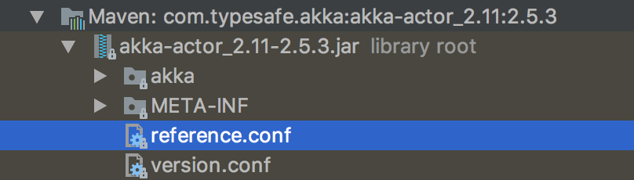
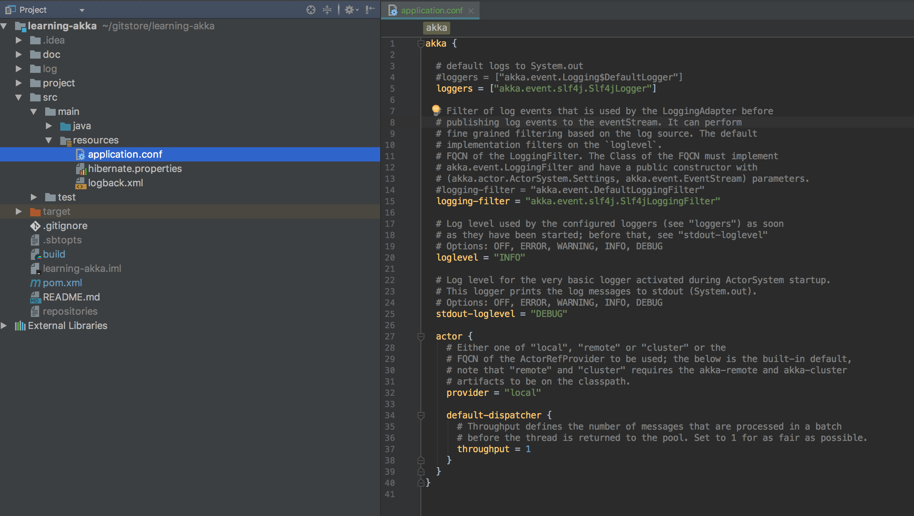

# 第一幕

## 故事:坐贾诞生

我呢是一个大老板,每天就想着投资干点啥大事业,一直都在成功的路上.夜里躺在床上辗转反侧,忽然灵机
一动,想到了我有好多书,看过的,没看过的,为何不开个店卖书呢?而且只卖自己看过的不错的书,买书的人
到我店里都不用做过多的纠结就能买一本高质量内容的书,而世界上有几十亿人口,如果有亿份之一长期卖
我的书,我就发财了.对,就开个书店,说干就干.

既然开店,第一步就是租店了.身在伟大的火长城中,最好只考虑长城内的店面.市场上转了一圈,在阿里云
租了一个最小的店面,可怜的只有一个计算器,还好还没啥人买我的书呢.在店的门口我列了一个清单,上面
写着我销售的所有书目.

随着爬虫的经常关顾,店里的人气也慢慢涨了起来,我在IM上你一言我一语的卖着我的书.这全球的人好像每
天都不睡觉,24小时都有人来和我买书.我已经两宿没合眼了,我得想想办法了.

是时候雇一个售货员(SellerActor)了,让他7X24小时售卖.他干的活也很单一,就是根据用户说的书名下
订单(CreateOrder).我能,就早上起来整理整理订单发货就好了.

## 技术:单应用中使用akka

讲代码前我们先来看看项目结构,这是一个标准的maven项目结构.整个项目源码我会给出maven配置和sbt
配置,但是后续我只用maven讲解如何运行示例代码.

```
learning-akka/
  |-doc/         文档(master分支上是最新最完整的文档)
  |-project/     配置sbt插件目录(如果用maven构建可以忽略这个目录)
  |-src/         源码
  |-target/      构建目录,里面是编译后的文件
  |-build        sbt配置文件(如果用maven构建可以忽略这个文件)
  \-pom.xml      maven配置文件(如果用sbt构建可以忽略这个文件)
```

### 第一次运行示例代码

安装如下步骤,让我们先把第一个版本的代码下载下来运行一下.

```bash
$ git clone git@github.com:qyf404/learning-akka.git
$ cd learning-akka
$ git checkout v1.1
$ git status
$ mvn test
```

看到如下内容就说明测试全部通过了.

```bash
[INFO] Surefire report directory: /Users/yfqi/gittemp/learning-akka/target/surefire-reports

-------------------------------------------------------
 T E S T S
-------------------------------------------------------
Running com.qyf404.learning.akka.order.SellerActorTest
Configuring TestNG with: org.apache.maven.surefire.testng.conf.TestNG652Configurator@5e91993f
Tests run: 1, Failures: 0, Errors: 0, Skipped: 0, Time elapsed: 2.269 sec

Results :

Tests run: 1, Failures: 0, Errors: 0, Skipped: 0
```

这里唯一要解释的就是`git checkout v1.1`,里面的`v1.1`是一个tag,代码会随着故事变化而变化.
为了方便追踪代码变化,每一幕都会给代码打多个tag,tag中第一个数字表示第几幕,第二个数字表示一个
从1开始的序列.比如`v1.1`表示第一幕的第一次标记.

### 讲解代码

> 以下源码在v1.1中.

在Application的main方法里给展现了如何向sellerActor发送命令.

```java
public class Application {
    public static void main(String[] args) {
        //初始化一个actor系统
        ActorSystem system = ActorSystem.create();
        //创建一个SellerActor
        ActorRef seller = system.actorOf(SellerActor.props());
        //向seller发送一个创建订单的命令
        seller.tell(new SellerActor.CreateOrder("Think in Java"), ActorRef.noSender());
    }
}
```

命令的内容被封装在了`SellerActor.CreateOrder`对象中.在akka中管这种封装数据的对象叫消息,而且要求消息一但创建不可被随意修改.

当`SellerActor`接收到消息后,首先识别消息类型,然后执行保存订单的操作.

```java
public class SellerActor extends AbstractActor {
    @Override
    public Receive createReceive() {
        return receiveBuilder()
                .match(CreateOrder.class, co -> {           // 识别消息类型
                    BookOrder bookOrder = new BookOrder();
                    bookOrder.bookName = co.bookName;
                    bookOrder.save();                       //保存订单
                })
                .build();
    }
}
```

akka就这么简单的让我们用起来了.在akka中最常用到的对象就是actor.akka也是基于一个actor模型
理论[^1]设计的.前面的示例代码我们并没有特意的配置akka,akka就开始工作了,主要是
因为在akka的jar包中有akka的默认配置`reference.conf`,默认akka作为本地服务使用的,.当然了,你也可以在项目中加
入akka的配置文件.



### 修改akka的配置文件

> 以下源码在v1.2中.

akka默认会读取项目中`application.conf`来初始化,我们可以通过增加这个文件来实现配置akka.
现在让我们把slf4j整合到akka中,配置如下:



```
akka {
  loggers = ["akka.event.slf4j.Slf4jLogger"]
  logging-filter = "akka.event.slf4j.Slf4jLoggingFilter"
  loglevel = "INFO"
  stdout-loglevel = "DEBUG"
  actor {
    provider = "local"
    default-dispatcher {
      throughput = 1
    }
  }
}
```

之后你再运行测试时就能看到这么一行日志:

```
[DEBUG] [07/19/2017 11:54:49.896] [main] [EventStream] StandardOutLogger started
[DEBUG] [07/19/2017 11:54:50.115] [main] [EventStream(akka://default)] logger log1-Slf4jLogger started
[DEBUG] [07/19/2017 11:54:50.116] [main] [EventStream(akka://default)] Default Loggers started
```


### 代码版本

代码地址: git@github.com:qyf404/learning-akka.git

| 版本 | 说明 |
|---|---|
| v1.1 | akka简单示例 |
| v1.2 | akka配置文件简单示例 |


[^1]: [actor模型理论]( https://en.wikipedia.org/wiki/Actor_model)

